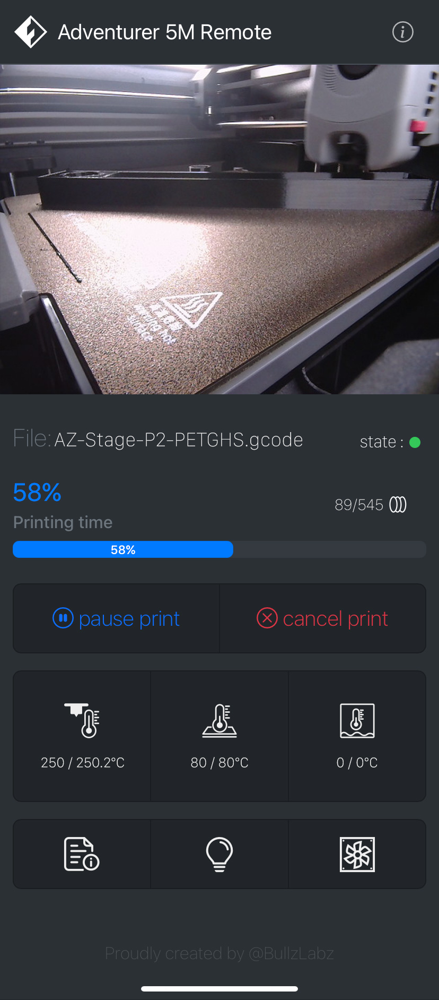
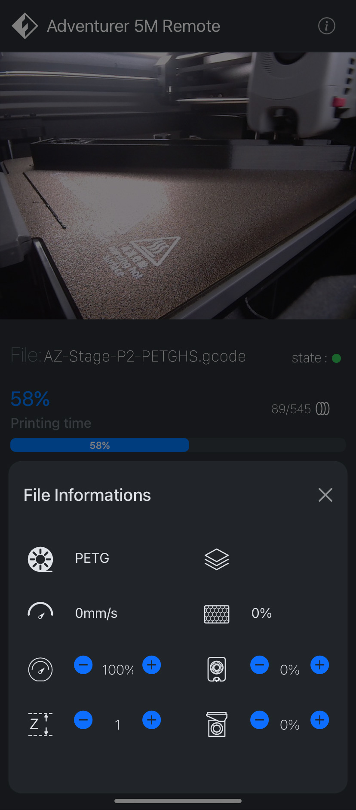
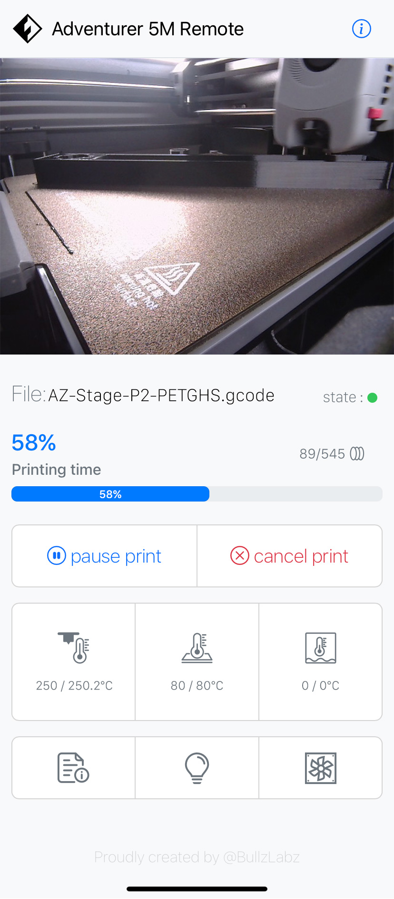
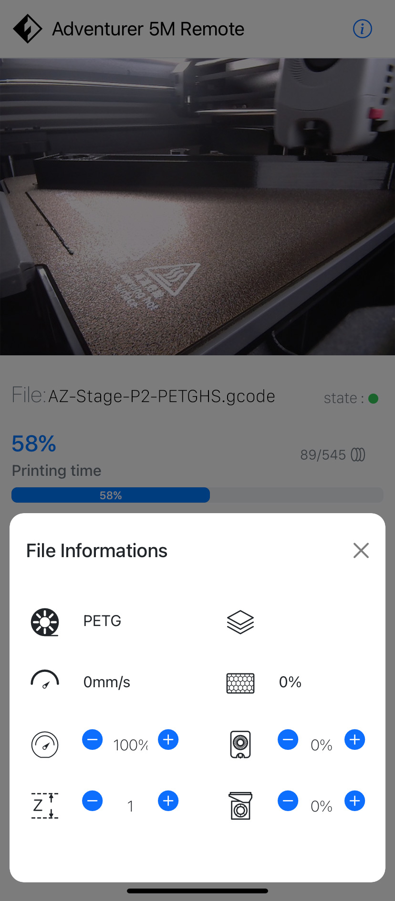

# Flashforge AD5M Series Web IDE Remote

___

I created this project to be able to more easily control some parameters of my Flashforge AD5M 3D printer such as:
* Turn on/off the lighting remotely ([Mod here](https://www.printables.com/model/786611-flashforge-adventurer-5m-led-bar-with-magnets))
* Check how the printing is going via the camera (Integrated or USB)
* Control the temperatures
* Check how much time is left to finish the printing

___

## <mark> **WARNING** </mark>

Currently the project is under development. Some bugs may appear
I have a good command of html and css but I have little knowledge of php and javascript/jquery and ajax.
Remember that this project is participatory and if you want to contribute, you are welcome!

___

### Here is the list of tasks at the moment (Oct. 25, 2024):
* ~~Creation of the responsive user interface (Desktop/Tablet/Mobile).~~
* ~~Creation of the icons, and necessary graphics.~~
* Convert/transform the php code into AJAX requests to avoid refreshing the data every 5 seconds. <mark> **URGENT** </mark>
* Adding features (printer information, network information, being able to access the content of the SD card… etc).
* more soon…

___

Here are some screenshots of the current state of this Web application.

|  |  |
| ------------------------------------------------------------ | ------------------------------------------------------------ |
|  |  |

## This project is based on:

* https://github.com/01F0/flashforge-finder-api
* https://github.com/mstraciak/flashforge-ad5m-mods

___
___

# Flashforge AD5M Series Web IDE Remote

___

J'ai créér ce projet pour pouvoir controller plus facilement certains paramètres de mon imprimante 3D Flashforge AD5M comme :
* Allumer/Eteindre l'éclairage à distance ([Mod here](https://www.printables.com/model/786611-flashforge-adventurer-5m-led-bar-with-magnets))
* Vérifier comment se déroule l'impression via la caméra (Intégré ou USB)
* Controller les températures
* Vérifier combien il reste de temps pour finir l'impression

___

## <mark> **ATTENTION** </mark>

Actuellement le projet est en cours de devellopement. Certains bugs peuvent apparaitre
Je maitrise assez bien le html et le css mais j'ai de faible notions avec le php et le javascript/jquery et ajax.
N'oubliez pas que ce projet est participatif et que si vous souhiatez contribuez, vous êtes le bienvenue!

___

### Voici la liste des tâches à l'heure actuelle (oct. 25, 2024):
* ~~Création de l'interface utilisateur responsive (Desktop/Tablet/Mobile).~~
* ~~Création des icônes, et des graphiques nécessaire.~~
* Convertir/transformer le code php en requêtes AJAX pour éviter le rafraîchissement des données toutes les 5 secondes. <mark> **URGENT** </mark>
* Ajout de fonctionnalités (informations sur l'imprimante, informations sur le réseau, pouvoir accéder au contenu de la carte SD… etc).
* more soon…

___

Voici quelques captures d'écran de l'état actuel de cette Web application.

|    |    |
| ------------------------------------------------------------ | ------------------------------------------------------------ |
|  |  |

## This project is based on:

* https://github.com/01F0/flashforge-finder-api
* https://github.com/mstraciak/flashforge-ad5m-mods

